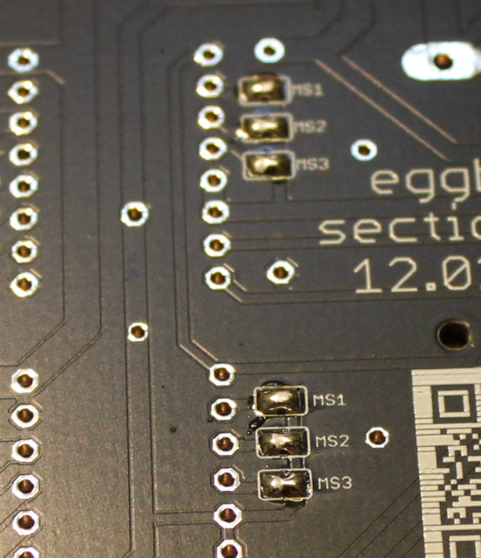
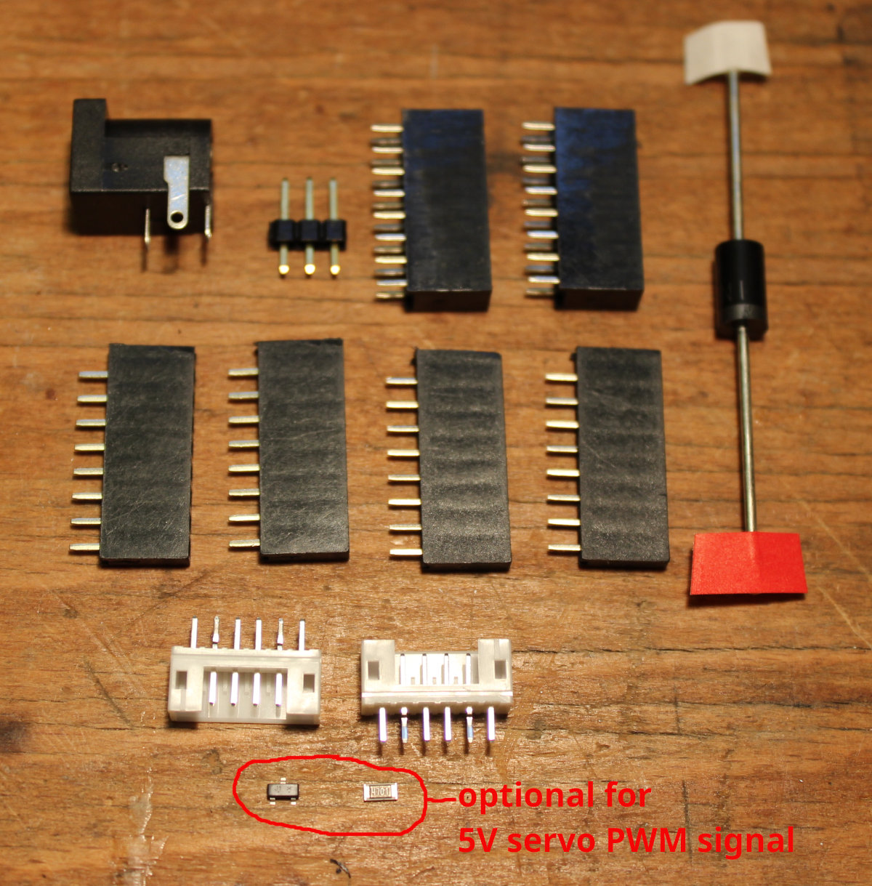
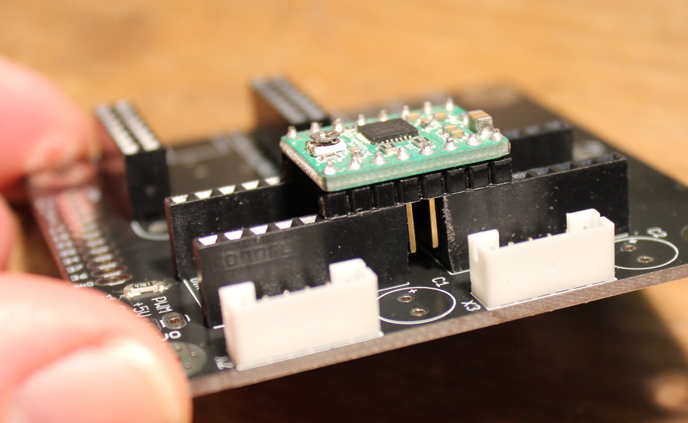
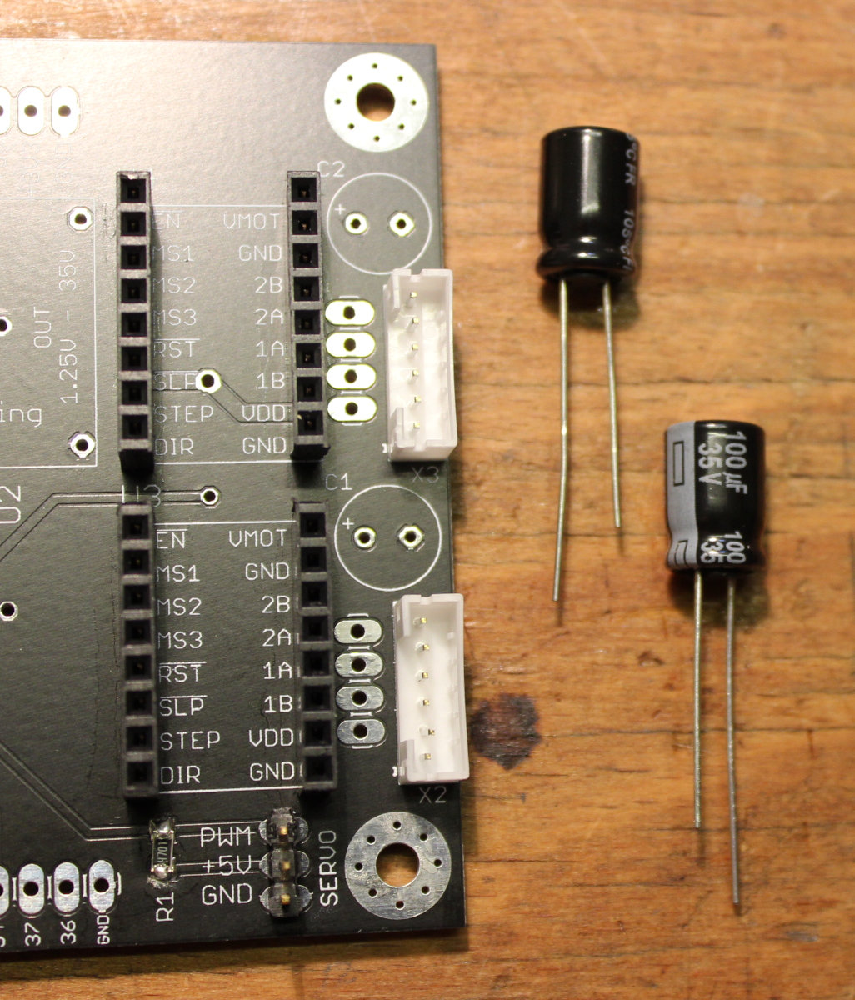
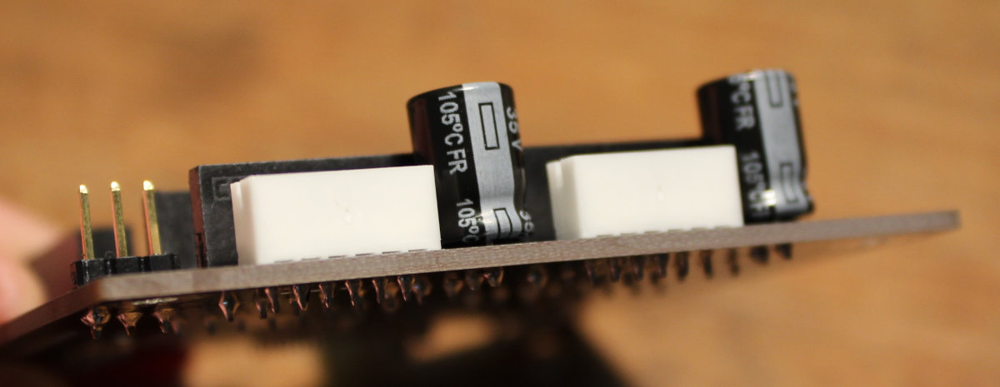
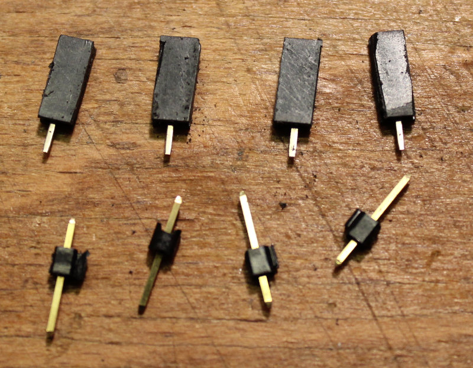

## eggbot77 Aufbauanleitung

Hinweis: Die Stiftleisten JP1 und JP4 werden für den Easterhegg-Workshop nicht verwendet und sind dafür gedacht falls jemand Erweiterungen anbringen möchte oder die Platine außerhalb der Osterzeit für andere Projekte verwenden will.

Wir haben versucht den Aufbau der Platine so detailiert wie nötig mit vielen Bildern zu beschreiben, so dass auch am Lötkolben wenig erfahrene Bastler zurecht kommen. Eine Einführung ins grundsätzliche Löten von Elektronikbauteilen enthält diese Anleitung nicht. Wenn es anfängt nach gebratenem Hühnchen zu riechen, hälst du den Lötkolben verkehrt herum ;-)

### Lötbrücke SJ7 schließen

Dadurch wird das 3,3V PWM Signal des ESP32s direkt an der Servo duchgegeben. Der SG90 "Micro Servo 9g" kommt normalerweise mit dem 3,3V Pegeln zurecht. Solltest du einen anderen Servo mit 5V PWM verwenden wollen, kannst du diesen Schritt überspringen und stattdessen Q1 und R1 einlöten.

Für den Easterhegg-Workshop empfehlen wir SJ7 zu schließen.

### Lötbrücken für microstepping schließen

Die Eggbot77 firmware geht davon aus, dass am A4988 Treiber 1/16 Microstepping aktiv ist (alle drei Lötbrücken MS1-MS3 geschlossen). Wenn Du einen anderen Schrittmtor, als den beigelegten Minebea 17PM-K374BN01CN verwenden willst oder den Schrittmotorstrom messen und einstellen willst, solltest du die Lötbrücken offen alssen und erst ganz am Ende schließen.

Für den Easterhegg-Workshop empfehlen wir alle 6 Lötbrücken zu schließen.

### Buchsenleisten vorbereiten

Wir müssen uns kürzere Buchsenleisten aus den großen 1x20 Buchsenleisten zuschneiden. Beim Abknipsen wird unweigerlich ein Pin zerstört, daher empfiehlt es sich genau mittig auf dem Pin zu schneiden und die entstehende Kante noch einmal nachzubearbeiten.

Es werden vorerst vier Stück 1x8 Buchsenleiste gebraucht (siehe übernächstes Bild)

### Vorbereitete Komponenten

### Buchsenleiste für U2

Die zwei 2x8 Buchsenleisten (fertig konfektioniert) einsetzen und umgedreht auf eine ebene Fläche legen.

Dann zuerst jeweils 1 Pin anlöten, nochmals den korrekten Sitz prüfen und dann alle Pins durchlöten.

### Buchsenleiten für U3 und U4

Es empfiehlt sich als Hilfmittel einen A4988 Treiber einzustecken um die Buchsenleisten in Position zu halten. Die JST Stecker X2 und X3 klemmen in den Löchern und können parallel eingesetzt werden.

Auf dem Bild sieht man die durchgelöteten Buchsenleisten für U2, U3, U3, X2 und X3

### Schottky Diode D1 einlöten

Beinchen mit einer Spitzzange passend abwinkeln

Nach dem Platzieren auf die passende Länge abschneiden. Die Beinchen vor dem Löten abzuschneiden ist ein wichtiger Schritt weil ansonsten zu viel Wärme abfließt, die dann an der Lötstelle fehlt. Für diesen und den nächsten Schritt (X1 einlöten) kann es notwendig sein den Lötkolben, bei Verwendung mit bleifreiem Lot, kurzzeitig auf 400°C zu stellen.

### Hohlbuchse X1 einlöten

### Kondensatoren vorbereiten

Wichtig: Auf korrekte Ausrichtung achten. Das lange Beinchen am Kondensator muss zum + Symbol auf der Platine, der weiße Strich mit "-" am Kondensator zeigt zum Rand.

### Sifte und Buchsen für U1 vorbereiten

Wie vorher gezeigt mit dem Seitenschneider 4 Stifte und 4 Buchsen von den großen Leisten abschneiden.

### Stifte an U1 anlöten

Es empfiehlt sich drei Stifte ausgerichtet in die bestehenden Buchsenleisten einzustecken und auf der LM2596 Platine anzulöten. Dies hielft bei der senkrechten Ausrichtung der Pins. Anschließend um 180° drehen und verbleibenden Pin anlöten.

### Buchsen an U1 anlöten

Auch hier ist es empfehlenswert die Vier vorher zugeschnittenen Buchsen ausgerichtet auf die Stifte aufzusetzen, dann die Platine zu wenden und dann die 4 Buchsen anzulöten.

### Ausgangsspannung U1 einstellen

Auf korrekte Ausrichtung von U2 achten: Der blaue Trimmer muss zum Rand der Platine zeigen, Die Ausrichtung der Aufschrift "IN+, OUT+" usw. muss zur Ausrichtung der unteren Platine "JP1" passen. Siehe auch nächstes Bild.

**Achtung:** Die A4988 Treiber U3 und U4 sowie der ESP32 wird zerstört, wenn sie eingebaut und die Platine mit 12V eingeschaltet wird, bevor die Ausgangsspannung am Spannungsregler U1 eingestellt wurde.

Daher vor dem Einstecken des Netzteils und dem ersten Einschalten nochmal darauf achten, dass U2, U3 und U4 nicht aufgesteckt sind. Siehe auch das nachfolgende Bild: 

Der Trimmer (roter Pfeil) muss ca. 12.5 mal gegen den Uhrzeigersinn gedreht werden, um die 5V am Ausgang einzustellen. Die Ausgangsspannung fängt erst nach ca. 7 Linksdrehungen an sich zu ändern, also bitte nicht vorzeitig aufgeben...

### Module aufstecken

Nun Netzteil ausstecken und die Module U2, U3 und U4 aufstecken. An U2 muss die USB-C Buchse an den Rand zeigen.

TODO: Ausrichtung U3, U4 explizit zeigen

### Servo und Schrittmotoren anstecken

Die orange Leitung am SG90 muss zur Platine "PWM" ausgerichtet sein. Andere Servos können andere Farbkodierungen haben.

Die Schrittmotoren mit den Leitungen verbinden, die Feritte zu der Platine hin.

### Hardware Testprogramm flashen

Es empfiehlt sich zuerst das Projekt ... Hardwaretest zu programmieren...
Um die Funktion der Komponenten vorab zu testen...

blabla Taster beim ersten mal flashen drücken usw...
