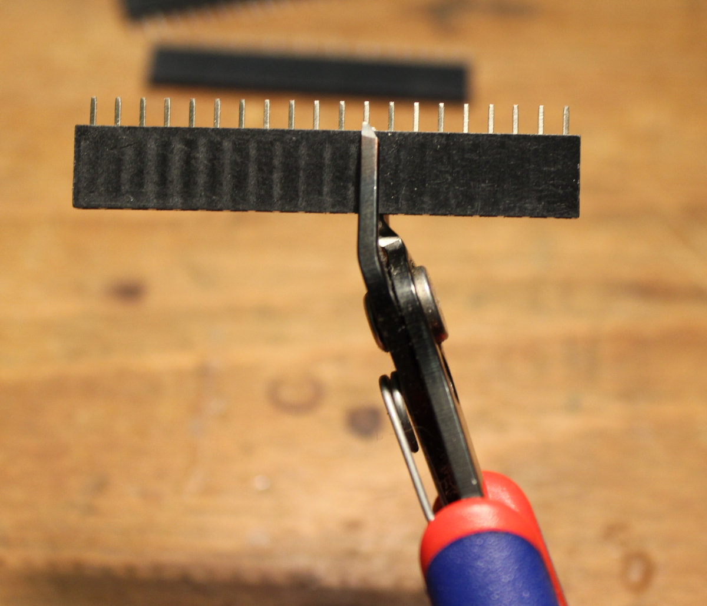
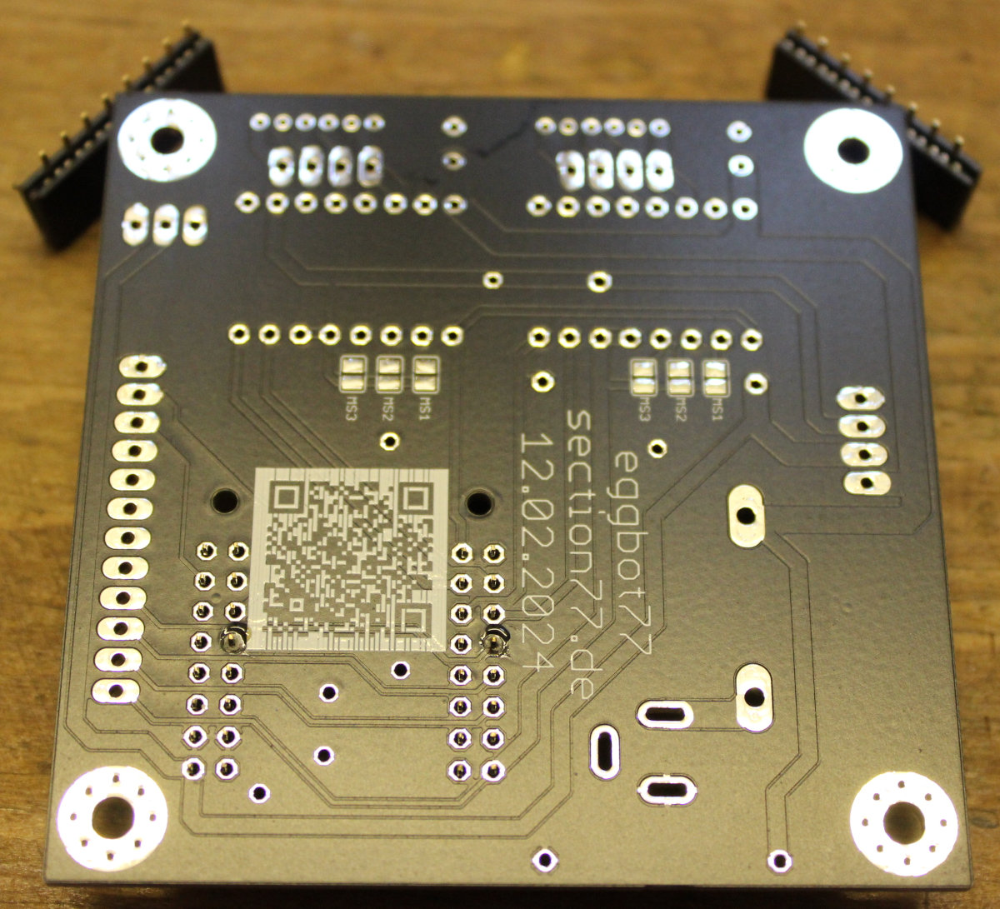
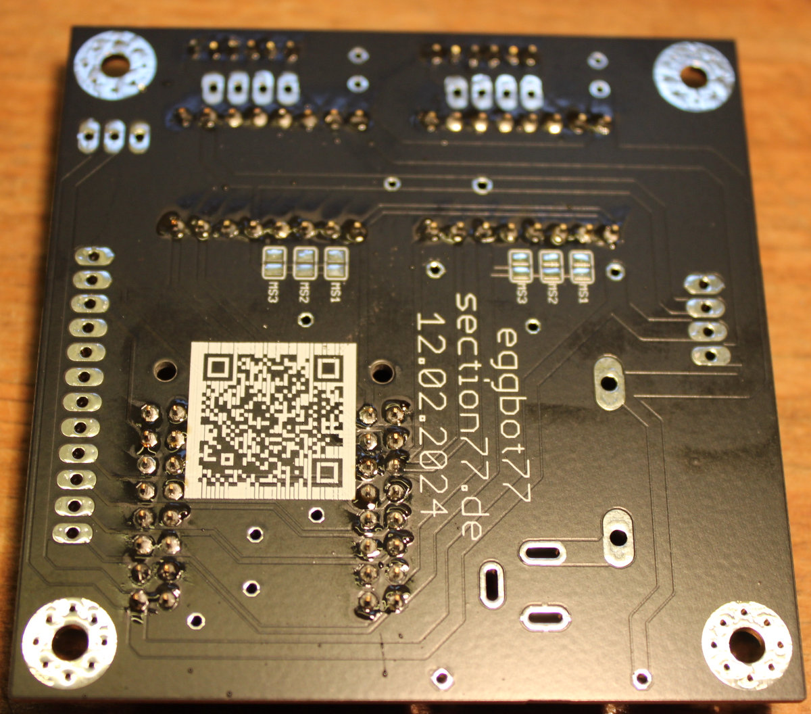
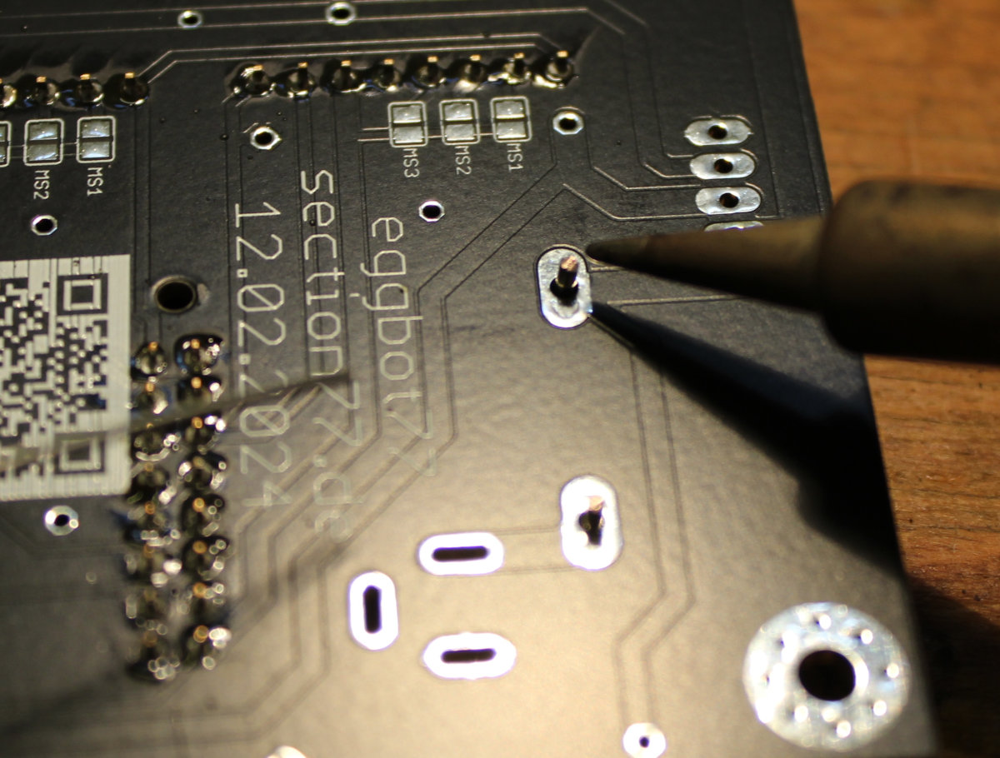
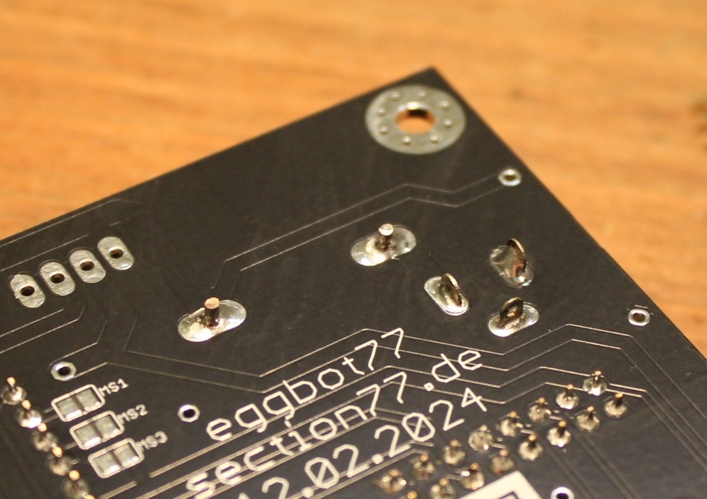
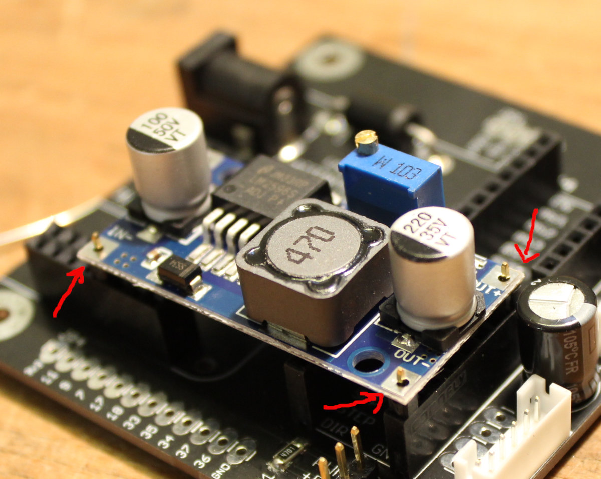
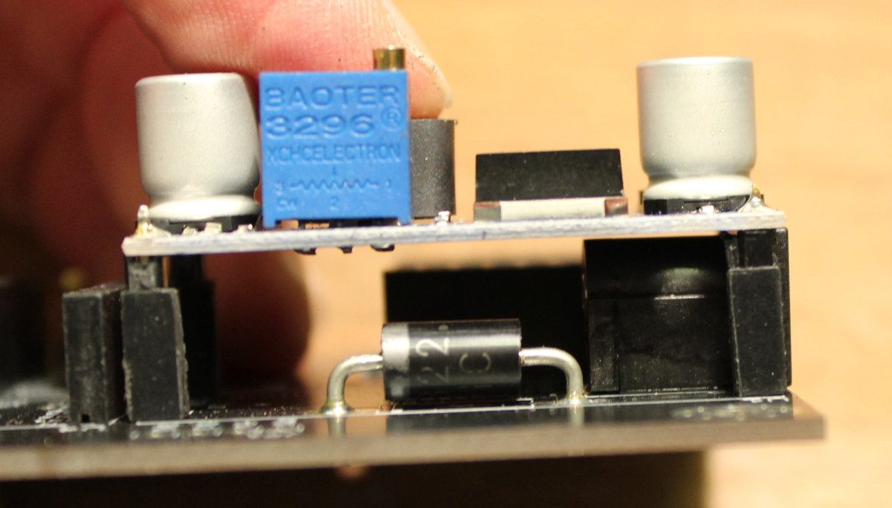
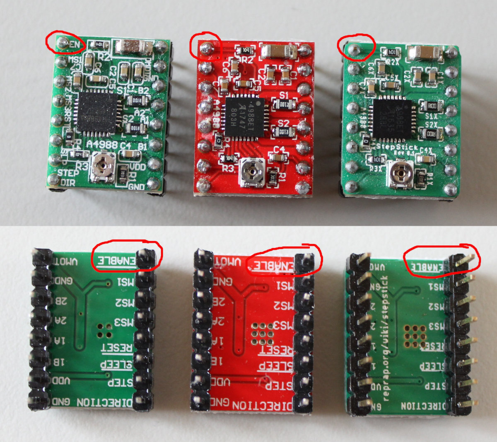
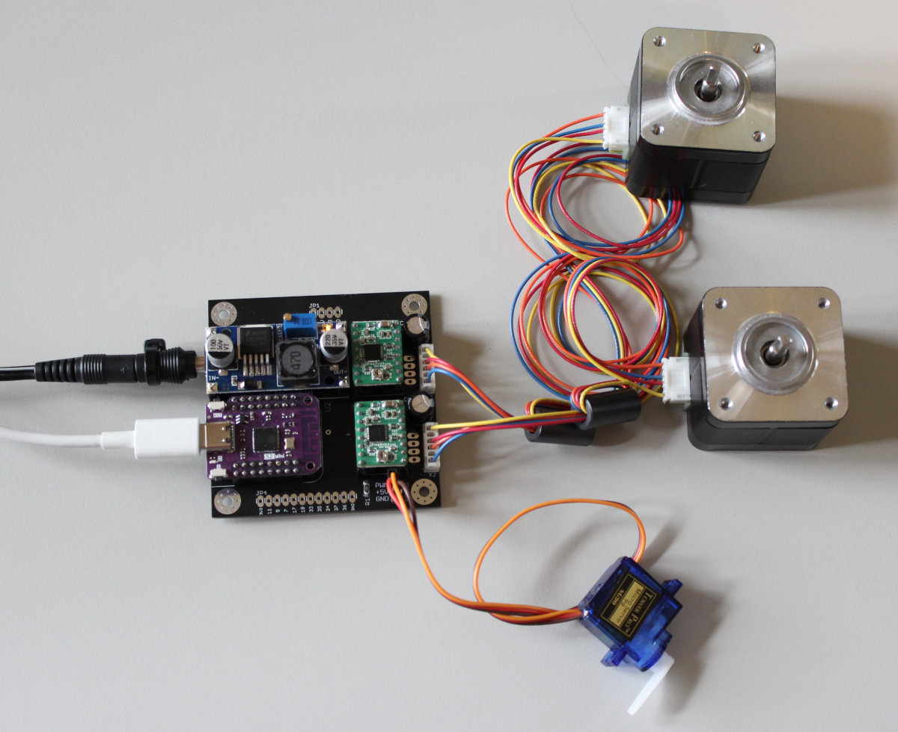

## eggbot77 assembly instructions

Note: The pin headers JP1 and JP4 are not used for the Easterhegg workshop and are intended for use if someone wants to add extensions or use the board for other projects outside the Easter period.

We have tried to describe the structure of the board in as much detail as necessary with lots of pictures, so that even less experienced hobbyists can manage with a soldering iron. These instructions do not contain an introduction to the basic soldering of electronic components. If it starts to smell like fried chicken, you're holding the soldering iron wrong ;-)

### Close solder bridge SJ7

This sends the 3.3V PWM signal from the ESP32 directly to the servo. The SG90 "Micro Servo 9g" normally copes with the 3.3V level. If you want to use a different servo with 5V PWM, you can skip this step and solder Q1 and R1 instead.

For the Easterhegg workshop we recommend closing SJ7.

### Close solder jumpers for microstepping

The Eggbot77 firmware assumes that microstepping is active on the A4988 driver 1/16 (all three solder jumpers MS1-MS3 closed). If you want to use a stepper motor other than the included Minebea 17PM-K374BN01CN or want to measure and set the stepper motor current, you should leave the solder bridges open at first and only close them at the very end.

We recommend closing all 6 solder bridges for the Easterhegg workshop.

### Preparing the socket strips

We have to cut shorter socket strips from the large 1x20 socket strips. One pin will inevitably be destroyed when clipping off, so it is advisable to cut exactly in the middle of the pin and to rework the resulting edge.

For the time being, four 1x8 socket strips are needed (see picture after next)

### Prepared components

### Socket strip for U2

Insert the two 2x8 socket strips (pre-assembled) and place them upside down on a flat surface.

Then solder on 1 pin at a time, check again that it is correctly seated and then solder through all the pins.

### Socket strips for U3 and U4

It is recommended to insert an A4988 driver as an aid to hold the socket strips in position. The JST connectors X2 and X3 are clamped in the holes and can be used in parallel.

The picture shows the soldered socket strips for U2, U3, U4, X2 and X3

### Solder in Schottky diode D1

Angle the legs appropriately with needle-nose pliers

After placement, cut to the appropriate length. Cutting off the legs before soldering is an important step because otherwise too much heat will flow away, which will then be missing at the soldering point. For this and the next step (soldering X1), it may be necessary to briefly set the soldering iron to 400°C when using lead-free solder.

### Solder in hollow socket X1

### Prepare capacitors

Important: Ensure correct alignment. The long leg on the capacitor must point to the + symbol on the circuit board, the white line with "-" on the capacitor points to the edge.

### Prepare pins and sockets for U1

Cut off 4 pins and 4 bushes from the large strips using the side cutters as shown above.

### Solder the pins to U1

We recommend inserting three pins into the existing socket strips and soldering them to the LM2596 board. This helps with the vertical alignment of the pins. Then rotate by 180° and solder the remaining pin.

### Solder the sockets to U1

Here, too, it is advisable to place the 4 previously cut sockets on the pins, then turn the board over and solder the 4 sockets.

### Setting the output voltage at U1

Ensure that the module is correctly aligned: The blue trimmer must point towards the edge of the circuit board. The alignment of the label "IN+, OUT+" etc. must match the alignment of the lower circuit board "JP1". See also the next picture.

**Attention:** The A4988 drivers (U3 and U4) and the ESP32 (U1) will be destroyed if they are installed and the board is operated with 12V before the output voltage has been set on the voltage regulator U1.

Therefore, before plugging in the power supply unit and switching on for the first time, make sure that U2, U3 and U4 are not plugged in. See also the following figure:

The trimmer (red arrow) must be turned anticlockwise approx. 12.5 times to set the 5V at the output. The output voltage only starts to change after approx. 7 counterclockwise turns, so please do not give up prematurely...

### Plug in the modules

Now unplug the power supply unit and plug in the modules U2, U3 and U4.

On U2 (the ESP32), the USB-C socket must point "left" to the edge.

On the A4988 modules, Enable/En must match the labeling on the board. The trimmer (with the cross slot) then points in the direction of the servo pin header (also shown in the picture after next).

The labeling on the back of the A4988 board is then upside down, so don't let this put you off.

It is important that the "Enable" pin circled in red matches the "En" on the board.

### Connecting the servo and stepper motors

The orange wire on the SG90 must be aligned with the "PWM" pin. Other servos may have different color coding.

Connect the stepper motors to the cables, the ferrites (the black tubes) to the circuit board.

### Check hardware with test program

If you want to program the ESP32 with the arduino IDE for the first time, you have to put it into DFU mode (Device Firmware Upgrade Mode):
* Press and hold button 0 on the ESP32 (lower left corner, labeled "0")
* Press the Reset button (top left corner, labeled "RST")
* Hold button 0 briefly and then release it

Make S2 boards into Device Firmware Upgrade (DFU) mode.

* Hold on Button 0
* Press Button Reset
* Release Button 0 When you hear the prompt tone on usb reconnection

Source: https://www.wemos.cc/en/latest/tutorials/s2/get_started_with_arduino_s2.html

It is recommended to first program the [hardware_test Arduino project](../../firmware/hardware_test/hardware_test.ino)
in order to test the correct function of the components in advance.

The servo runs slowly from the minimum position to the maximum position, both stepper motors rotate at different speeds alternately in both directions and the blue onboard LED flashes at 1Hz.

If this works, nothing stands in the way of programming the correct [EggBot77 firmware](../../firmware/EggBot77/EggBot77.ino) for communication with the Inkscape plugin.

Continue with the [Installation of the Inkscape plugin](../../inkscape_1.x_extension/README.md)
