## eggbot77 assembly instructions for the mechanics

In the tradition of a popular manufacturer of kids toys located in the city of Billund, Denmark (whose name we will intentionally omit here for reasons) we have divided the manual in several assembly groups:

## assembly group 1: fixation of the egg

Tools needed: TBD

Screw the threaded rod (M5) and insert it half way through the [tailstock holder](eb77-eh21_bauteil-01-IMG_4891.JPG)
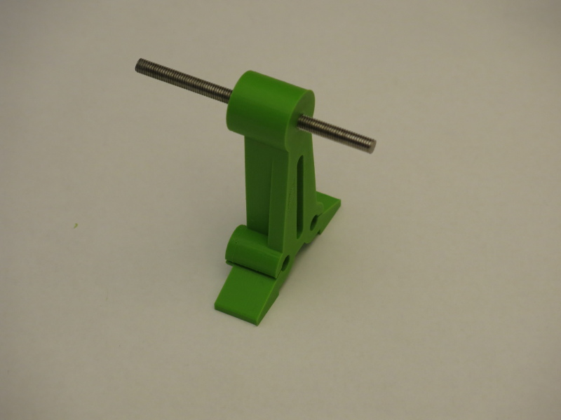

Add one of the M5 nuts on the flat(!) side of the tailstock holder

Add the bearing (625ZZ) and the second of the M5 nuts to the rod.
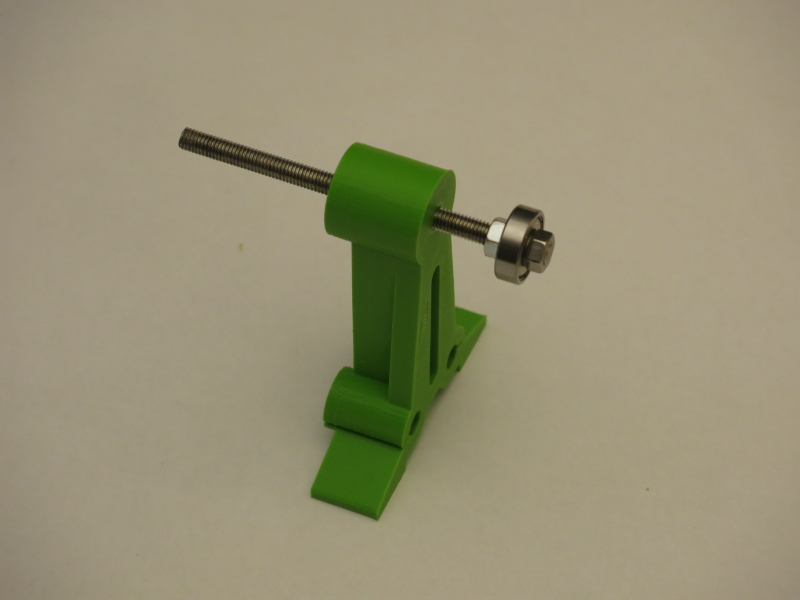

Hints: 
* the second nut should be flush with the end of the threaded rod, next to the bearing which should be next to the nut you inserted first
* make sure the two nuts hold the bearing firmly. That will take some artistic degrees of freedom from you eggbot77, though ;)

Now only the [faucet](eb77-eh21_bauteil-02-IMG_4895.JPG) is missing - ready is your first assembly group! You're doing great! ;)
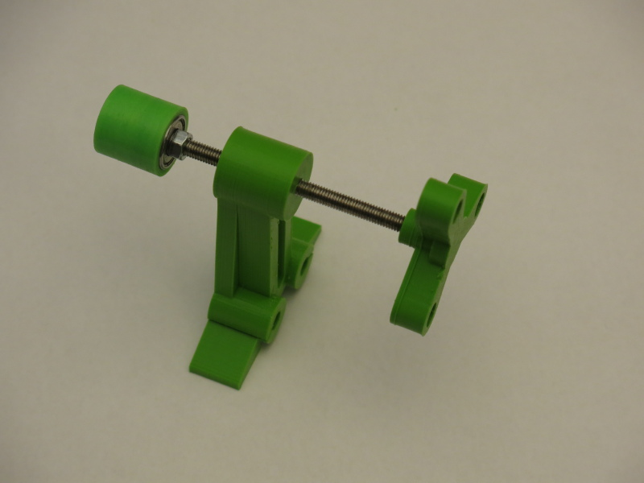

Oh - we didn't count putting the [Eierhalter Lagerseite](eb77-eh21_bauteil-03-IMG_4906) to the bearing.

## assembly group 2a: fixation of the pen

Don't get a drink just yet - this will be a very quick one.
Insert the M4 bolt into the [nut knob](eb77-eh21_bauteil-04-IMG_4899.JPG)
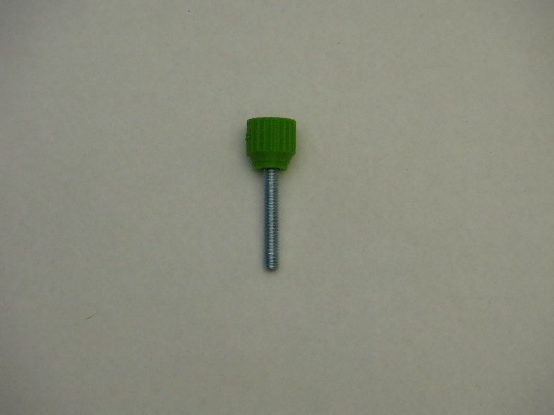

There you go - assembly group 2a is done, too!

## assembly group 2b: pen holder arm (integrates assembly group 2a)

This is going to be a bit trickier. But do not worry. You'll be fine.
Insert the M3x20 bolt with the cylinder head through the hole in the [toolmount](eb77-eh21_bauteil-05-IMG_4897.JPG) attaching the [spring](eb77-eh21_bauteil-06-IMG_4902.JPG) to it.
Hints: give the following picture a close look and you'll see which of the many ways this could be done is the only correct one.

Now take the M3x30 bolt to attach the [penarm](eb77-eh21_bauteil-07-IMG_4900.JPG) to the toolmount.

Next you insert the M4 but into the cutout in the toolmount and screw assemby group 2a into it.
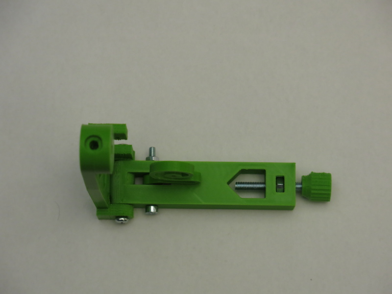

Getting more tricky now: attach the blue mini servo using the 2 miniature screws. Insert the screws from the servo side so they will rest in the penarm.

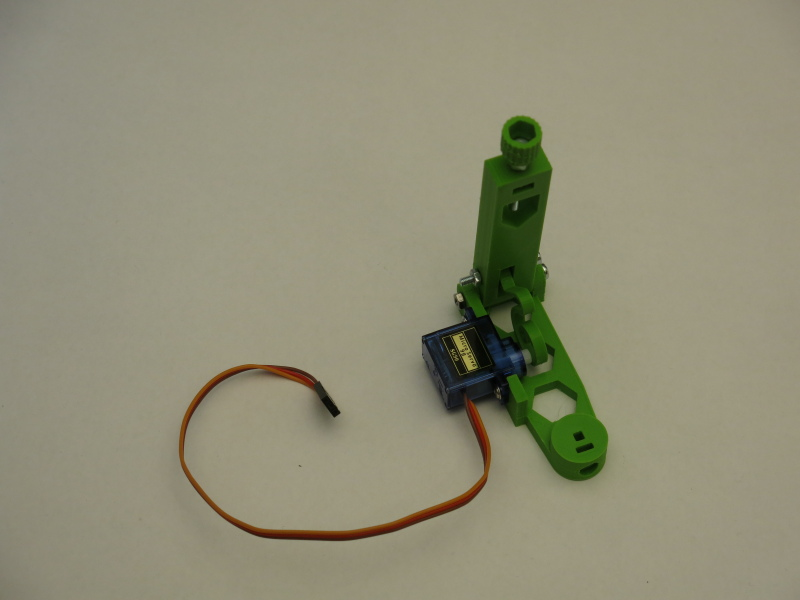

Fix the servo arm with the single 3mm screw.
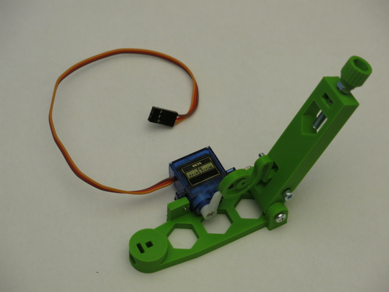

Hint: you might need to re-adjust the angle at which the arm is fixed to the servo. So don't worry too much about that now.

One more special screw (the smallest one that was provided to you as part of the kit) will fix the open end of the spring to the servo arm. Use the last of the holes inside the arm.
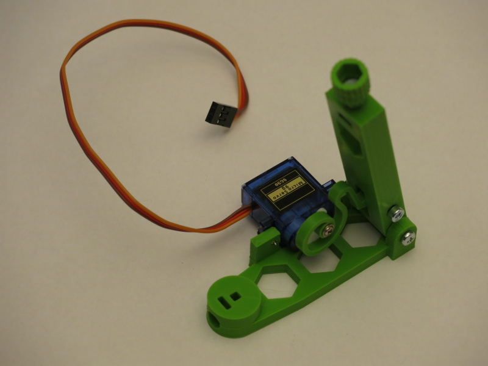

## assembly group 3: PCB holder
That's an easy one again. Use the 4 3mm screws to attach the PCB to the [nema eggbot77 mount/PCB holder](eb77-eh21_bauteil-08-IMG_4901.JPG) with the [spacers](eb77-eh21_bauteil-09-IMG_4905.JPG).
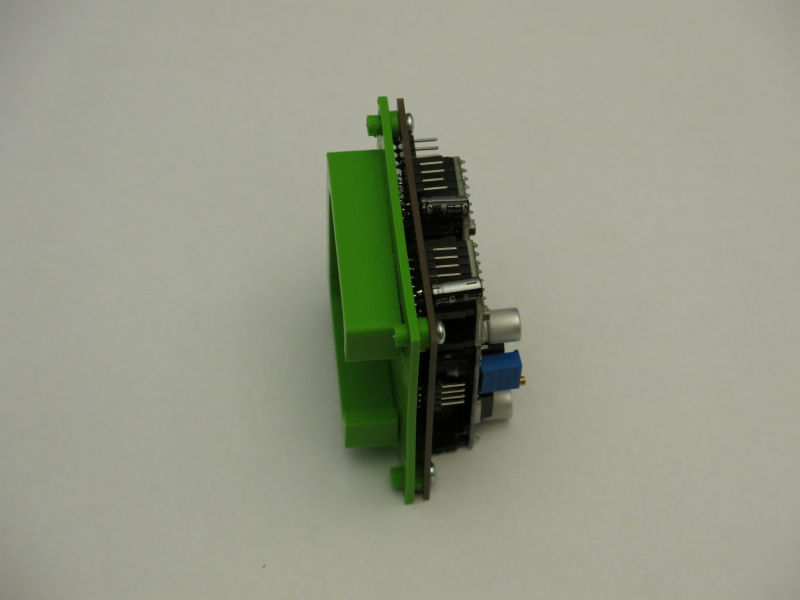
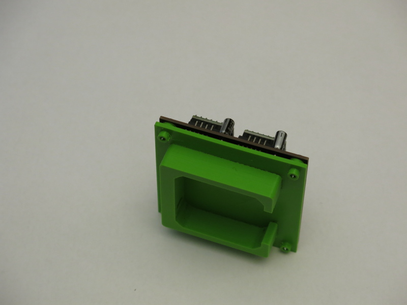

## complete assembly: integrates remaining single parts and all assembly groups
You are now ready to assemble your EggBot77! Take the 2 shorter (!) ones of the 6mm alumiminum rods and put them through the bottom holes of the [box intersecting rods](eb77-eh21_bauteil-10-IMG_4889.JPG). Which is the bottom side of the box? Glad you ask! That's the one that accepts the M3 nut; so, the top one is the one that has a countersunk hole for the bolt. Now take the 2 remaining rods and put them through the remaining holes of the box.

Now insert the countersunk M3x20 to the top of the box and secure it with the remaining M3 nut.

 

 
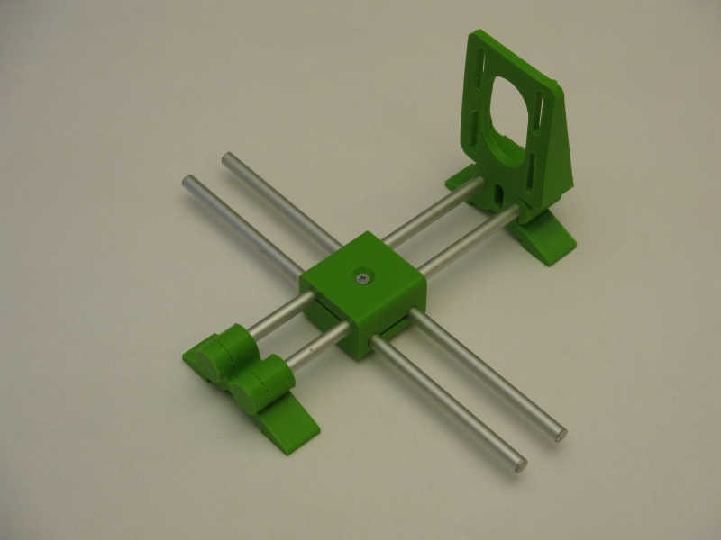

 

 
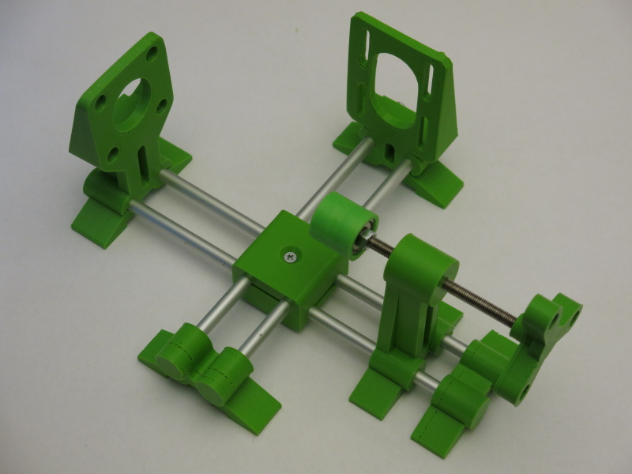

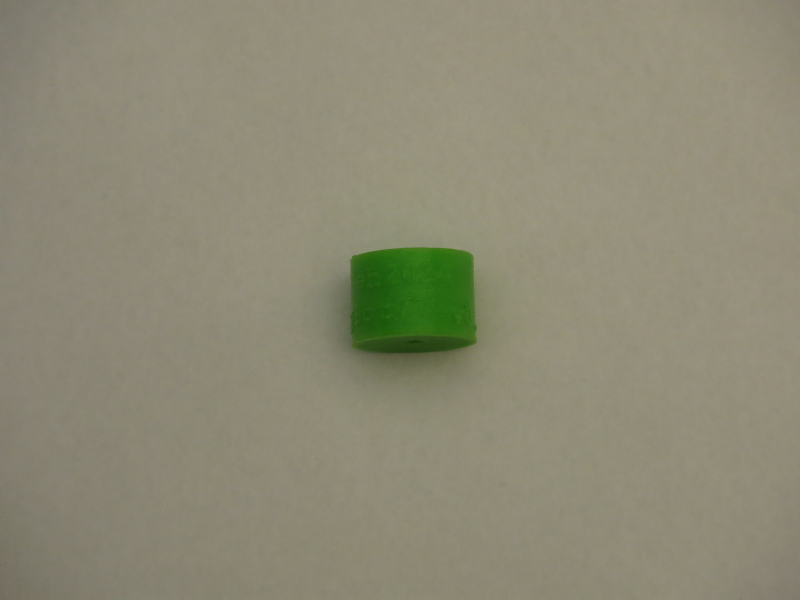

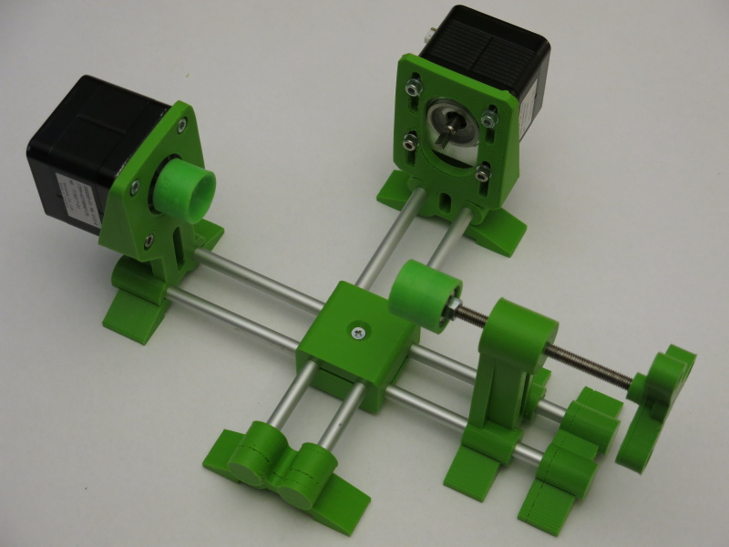

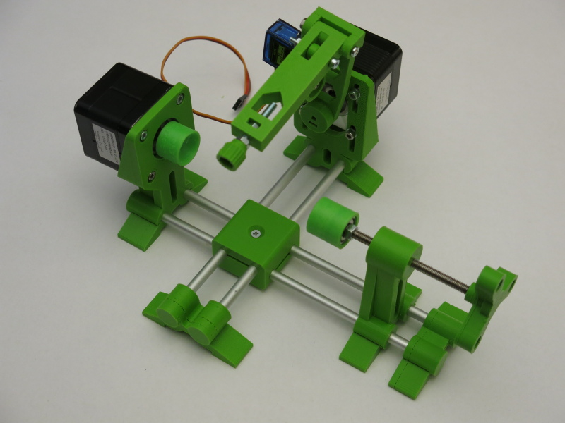

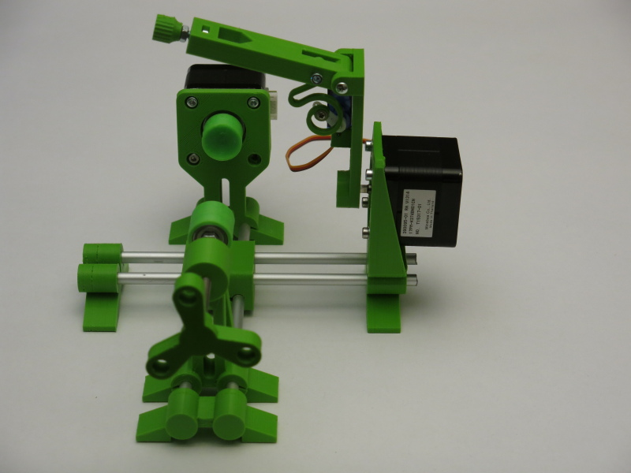

